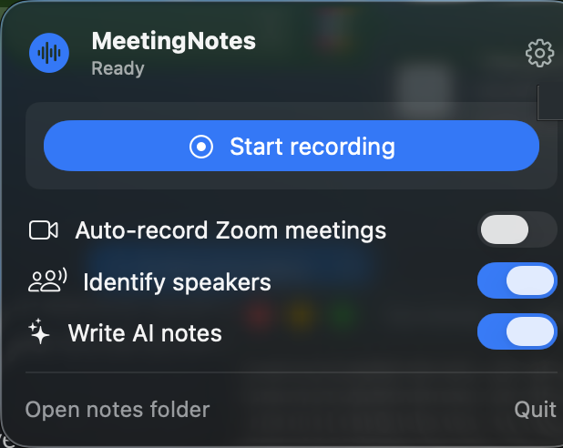
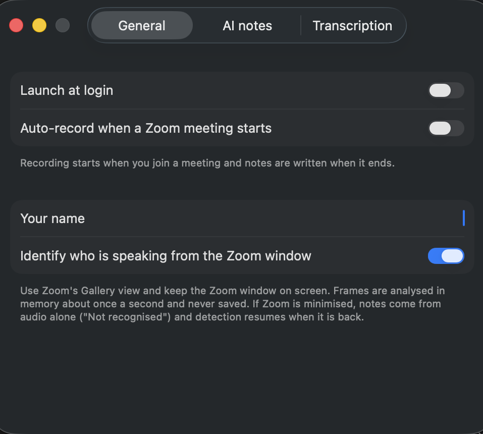

# MeetingNotes

A free, open-source, lightweight macOS menu-bar app that records a Zoom meeting **locally** and turns
it into a short summary plus long, detailed notes, using your own Claude or OpenAI API key.

It does not join the call as a bot and adds nothing to the meeting, so Zoom does not notify other
participants. Recording laws differ by country and company. See [Responsible use](#responsible-use).

| Menu bar | Settings |
|---|---|
|  |  |

## Features

- **Records locally:** Zoom's audio (the other participants) through ScreenCaptureKit, and your voice
  through the microphone. Nothing leaves your Mac except the transcript sent to the AI provider you pick.
- **British and Indian English:** Whisper transcription is fixed to English with an accent and
  vocabulary hint, and the AI is told to fix obvious mishearings from context.
- **Who said what:** in Zoom's Gallery view the active speaker gets a green border. About once a second
  the app finds that border in the Zoom window and reads the name label with on-device OCR (Apple
  Vision), so the transcript says `Priya Sharma:` instead of `Others:`. Frames are never saved.
- **Audio-only fallback:** if Zoom is minimised or on another Space, recording carries on, those lines
  are labelled `Not recognised`, and speaker detection resumes on its own when the window is back.
- **Bring your own AI:** Claude (Anthropic) or ChatGPT (OpenAI). The model list is fetched live from the
  provider, so new models appear without an app update. Keys are kept in the macOS Keychain.
- **Free transcription:** offline `whisper.cpp`, or the OpenAI Whisper API if you prefer.
- **Hands-free:** optional auto-record when a Zoom meeting starts, launch at login, and a macOS
  notification when the notes are ready.

## Example output

Each meeting gets a folder in `~/Documents/MeetingNotes/<date time>/`. The example below is fictional.

`transcript.md`

```text
[00:04] Alex: Morning all. Quick one today, the release plan and the login bug.

[00:11] Priya Sharma: So the fix is merged, but QA found one more edge case with expired sessions.

[00:24] James Carter: Can we still ship on Thursday, or do we push to Monday?

[00:31] Not recognised: I think Thursday is fine if QA signs off by Wednesday evening.
```

`notes.md`

```markdown
## Summary
- Login bug fix is merged; one edge case with expired sessions remains.
- Release stays on Thursday if QA signs off by Wednesday evening.

## Decisions
- Keep the Thursday release date, conditional on QA sign-off.

## Action items
- [ ] Fix the expired-session edge case (Priya Sharma, Wednesday)
- [ ] QA sign-off on the release build (QA team, Wednesday evening)

## Open questions
- Who owns the rollback plan if sign-off slips?

## Detailed notes
### Login bug
Priya confirmed the fix is merged. QA reproduced one more case where an expired session ...

### Release plan
James asked whether Thursday is still realistic ...
```

## How it works

```text
Zoom audio ─┐                       ┌─ whisper.cpp (local, free) ─┐
            ├─ 16 kHz WAV chunks ───┤                             ├─ transcript.md ─ Claude / GPT ─ notes.md
Microphone ─┘                       └─ OpenAI Whisper API ────────┘        ▲
Zoom window frames (1 fps) ─ green border + OCR ─ speaker timeline ───────┘
```

Audio is written in 10-minute chunks (each stays under the Whisper API's 25 MB limit) and deleted once
the notes are written. It is kept only when something fails, so you can press **Retry**.

## Setting up on a new Mac

Needs macOS 13 (Ventura) or newer, on Apple Silicon or Intel. Takes about 10 minutes, most of it downloads.

### 1. Install the tools (one time)

```bash
# Swift compiler (skip if Xcode is installed; `swift --version` should work afterwards)
xcode-select --install

# Homebrew (skip if `brew --version` already works)
/bin/bash -c "$(curl -fsSL https://raw.githubusercontent.com/Homebrew/install/HEAD/install.sh)"

# Free, offline speech-to-text
brew install whisper-cpp
```

### 2. Download the speech model (one time, ~550 MB)

```bash
mkdir -p ~/Library/Application\ Support/MeetingNotes
curl -L -o ~/Library/Application\ Support/MeetingNotes/ggml-large-v3-turbo-q5_0.bin \
  https://huggingface.co/ggerganov/whisper.cpp/resolve/main/ggml-large-v3-turbo-q5_0.bin
```

Skip steps 1–2 for whisper if you will use the **OpenAI Whisper API** for transcription instead
(Settings → Transcription); that uploads the audio to OpenAI and needs an OpenAI key.

### 3. Get the code and build the app

```bash
git clone https://github.com/sunny-github69/learn-.git
cd learn-/MeetingNotes
./scripts/build_app.sh                      # creates build/MeetingNotes.app
cp -R build/MeetingNotes.app /Applications/ # needed for "Launch at login"
open /Applications/MeetingNotes.app
```

A waveform icon appears in the menu bar (top right). There is no Dock icon; that is expected.

> Keep the repo out of iCloud Drive / OneDrive / Dropbox folders: the build creates thousands of
> files in `.build/` and the sync client will slow it down.

### 4. Configure

Click the menu-bar icon, then the ⚙︎ button in the top-right corner of the popover:

- **AI notes**: pick Claude or ChatGPT, paste your API key (create one at
  [console.anthropic.com](https://console.anthropic.com) or
  [platform.openai.com](https://platform.openai.com/api-keys)). It is checked live ("Key works · N models")
  and the model list loads; pick a model. Keys are stored in the macOS Keychain, never in files.
  Turn AI notes off to save only the transcript.
- **General**: *Launch at login*, *Auto-record when a Zoom meeting starts*, your name (used instead
  of "You" in the transcript), and *Identify who is speaking*.
- **Transcription**: local whisper.cpp (shows "Model found" if step 2 worked) or the OpenAI API.

The three main switches (auto-record, speakers, AI notes) are also in the menu-bar popover.

### 5. Grant permissions and do a test recording

1. Start a Zoom meeting (alone is fine) and switch to **Gallery view**. Use headphones.
2. Press **Start recording**. macOS asks for:

   - **Microphone** → Allow.
   - **Screen & System Audio Recording** → open System Settings → Privacy & Security → enable
     *MeetingNotes*. macOS may ask you to quit and reopen the app; do so and start again.
3. While recording, the popover shows a timer and who is speaking, e.g. "Priya Sharma is speaking".
   Minimise Zoom and it switches to "Zoom not visible – notes from audio only".
4. Press **Stop & write notes**. When the notification arrives, click it (or **Open**) to read the notes.

To test speaker names, join the same meeting from a phone and talk from there.

### Daily use

- **Manual:** menu-bar icon → **Start recording** → **Stop & write notes**.
- **Automatic:** turn on **Auto-record Zoom meetings**. Recording starts when you join a meeting and
  the notes are written when you leave. Pressing Stop mid-meeting stops it for that meeting.
- Past meetings are listed under **Recent** in the popover; **Open notes folder** shows all of them.

### Updating

```bash
cd learn-/MeetingNotes
git pull
pkill -x MeetingNotes                       # quit the running copy (ignore "no process found")
./scripts/build_app.sh
rm -rf /Applications/MeetingNotes.app
cp -R build/MeetingNotes.app /Applications/
open /Applications/MeetingNotes.app
```

The app is ad-hoc signed, so macOS treats each build as a new app: if recording fails after an update,
remove *MeetingNotes* from Privacy & Security → Screen & System Audio Recording and Microphone, and
allow it again. Settings and API keys are kept.

### Troubleshooting

| Problem | Fix |
|---|---|
| `cd: no such file or directory` | Run the commands from the folder you cloned into (`pwd` shows where you are). |
| `swift: command not found` | `xcode-select --install`, then open a new terminal. |
| "whisper-cli not found" | `brew install whisper-cpp` |
| "Whisper model not found" | Redo step 2, or fix the path in Settings → Transcription. |
| Notes have no "Others" lines | Screen & System Audio Recording permission is missing; grant it and reopen the app. |
| Every line is "Not recognised" | Use Zoom's Gallery view and keep the Zoom window visible. |
| "Couldn't change login item" | Move the app to `/Applications` first. |
| API error | Check the key and the account's credit in the Claude / OpenAI console. |

### Uninstall

```bash
rm -rf /Applications/MeetingNotes.app ~/Library/Application\ Support/MeetingNotes
defaults delete com.local.meetingnotes
```
Meeting notes in `~/Documents/MeetingNotes` are left alone.

## How auto-record works

The app watches for Zoom's `CptHost` helper process, which exists only during a meeting: recording
starts when you join and the notes are written when you leave.

## Limitations
- Speaker names need Gallery view and the Zoom window visible (not minimised). Speaker view has no
  green border, so those lines fall back to `Not recognised`.
- Start Zoom before recording: then only Zoom's audio is captured. Otherwise it falls back to all system audio
  and speaker names are off.
- Use headphones, otherwise Zoom audio leaks into your mic and gets transcribed twice.
- Speaker names come from OCR of Zoom's UI and can lag by a line, or misread an unusual name.
- Zoom must be on the main display.

## Responsible use

You are responsible for how you use this app. Recording laws differ by country and state (some require
every participant's consent), and many employers have recording policies. Check both before recording
a meeting without telling people.

## Privacy

- Audio and Zoom frames are processed on your Mac. Frames are never written to disk.
- The transcript is sent only to the AI provider you choose (and, if you pick the OpenAI Whisper API,
  the audio is uploaded to OpenAI).
- API keys are stored in the macOS Keychain, not in files or in this repository.
